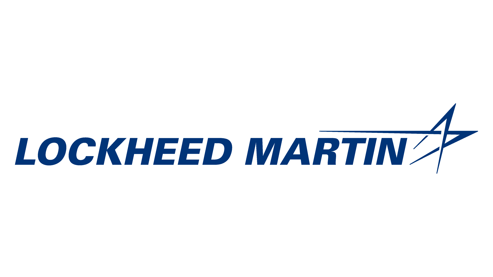
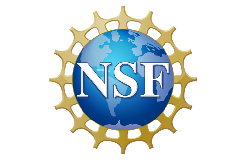
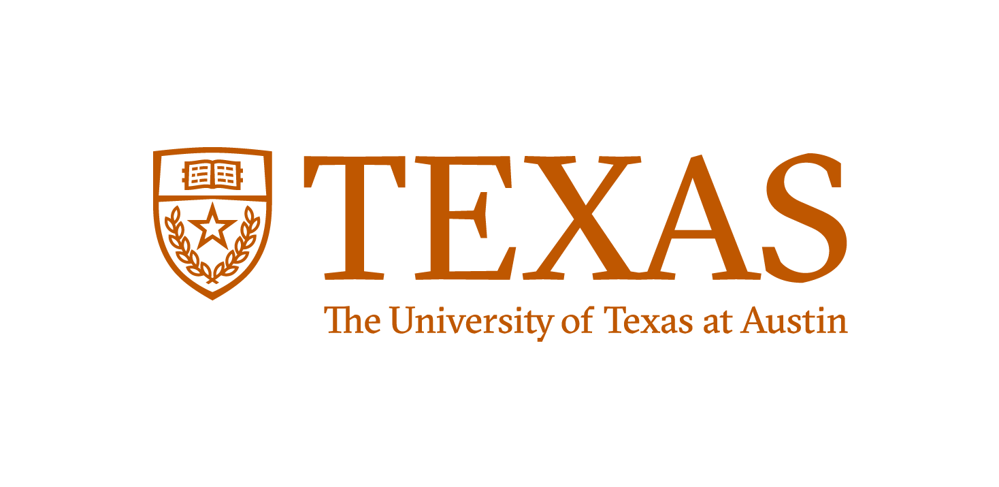

# Surender Kannah — Autonomous Systems & Robotics

## Affiliations

  
  
  
  

---

## About Me

I’m an autonomy and robotics engineer focused on **safety‑critical systems**, **robust GNC**, **dense perception**, and **multi‑sensor fusion**. My work spans **orbital docking**, **SLAM‑based navigation**, **embedded ML**, and **mission‑critical defense autonomy**.

Outside of engineering, I’m passionate about product building, early‑stage startups, and applied AI systems.

This page highlights selected projects and demos that reflect my trajectory toward **orbital‑grade autonomy** and **mission‑critical robotics**.

---

## Resume
[Download Resume](https://skannah.github.io/Kannah_Surender_Resume.pdf)

---

## Featured Projects

### Project ARES — Autonomous Docking & Safety‑Critical GNC
6‑DOF autonomous docking system with Lyapunov‑based safety layers, Monte‑Carlo robustness testing, and real‑time guidance.

### TurtleBot3 Navigation — SLAM + AMCL + Nav2
Full navigation stack including SLAM mapping, AMCL localization, and Nav2 path planning with custom tuning.

### Dense 3D Perception Pipeline
Multi‑camera dense reconstruction pipeline using stereo depth, segmentation, and geometric fusion for navigation.

### Multi‑Sensor Fusion & Tracking (EKF + JPDA/MHT)
Probabilistic tracking system combining IMU, vision, and radar using EKF fusion and multi‑hypothesis data association.

### Julia CV — Multi‑Camera Computer Vision Workflow (NSF I‑Corps)
Production CV workflow for defect detection across multi‑camera systems; deployed in early B2B pilots.

### Vanguard Node — Robotic Arm & Fixture CAD
Mechanical design and CAD for a robotic arm fixture enabling repeatable manipulation and perception experiments.

### Embedded ML & Real‑Time Inference Demo
Optimized CV/ML models for real‑time inference on constrained hardware using TensorRT and CUDA.

For more detail, see the [Projects](projects.md) page.

---

## Coursework
See selected graduate coursework: [Courses](courses.md)

---

## Research
Explore my autonomy research interests: [Research](research.md)

---

## Contact

  

  

  

**Email:** surender@gmail.com  
**LinkedIn:** /in/surenderkannah  
**GitHub:** skannah
